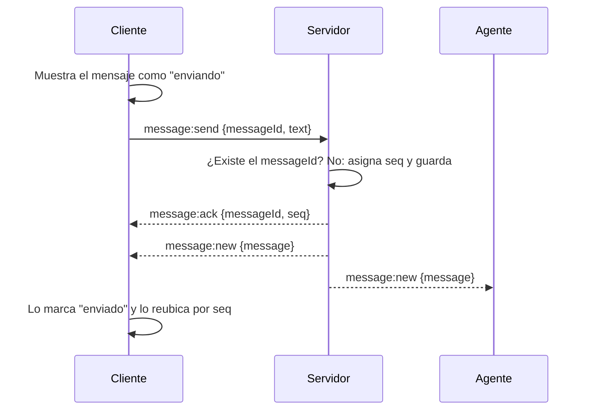
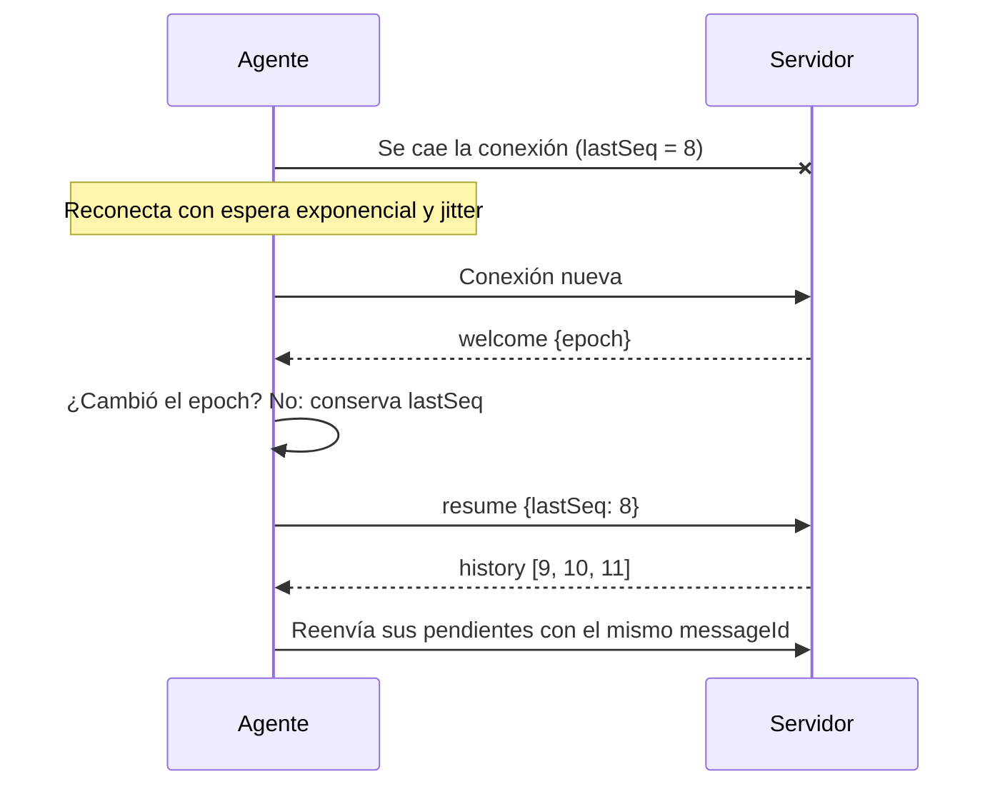

# Diseño: chat de soporte en tiempo real

## Contexto

Dos participantes, un cliente y un agente, intercambian mensajes en una conversación y los ven aparecer sin recargar la página. La conexión de cualquiera de los dos puede caerse en cualquier momento, y ambos pueden escribir casi al mismo tiempo.

## Objetivos

- Ningún mensaje confirmado se pierde por una desconexión.
- Un reintento nunca produce un mensaje duplicado.
- Ambos participantes ven el mismo orden.
- La reconexión es automática y recupera lo que faltó.

## Fuera de alcance

- Autenticación real.
- Lista de conversaciones para el agente.
- Indicador de "está escribiendo", confirmación de leído y archivos adjuntos.
- Guardar los pendientes en `localStorage`.
- Despliegue real en AWS (se documenta en la decisión 8).
- Docker: se descartó para dedicar ese tiempo a la prueba E2E (decisión 8).
- **Solo si sobra tiempo:** un mensaje automático cuando el cliente escribe y no hay agentes conectados, y una prueba de componente de los estados del mensaje.

---

## Contrato

Es lo primero que se define, porque es la información que manejan ambos frentes.

**Conexión:** `GET /ws?role=cliente|agente&conversation=demo`, con upgrade a WebSocket. El servidor fija el rol y la conversación en ese momento.

```ts
type Role = 'cliente' | 'agente';

interface Message {
  messageId: string;      // UUID generado por el cliente
  conversationId: string;
  seq: number;            // asignado por el servidor, incremental por conversación
  sender: Role;           // fijado por el servidor según la conexión, no por el cliente
  text: string;
  serverTs: string;       // ISO 8601, solo informativo; no define el orden
}

// Cliente → Servidor
type ClientEvent =
  | { type: 'resume'; lastSeq: number }
  | { type: 'message:send'; messageId: string; text: string };

// Servidor → Cliente
type ServerEvent =
  | { type: 'welcome'; epoch: string; conversationId: string; role: Role }
  | { type: 'history'; messages: Message[] }
  | { type: 'message:ack'; messageId: string; seq: number; serverTs: string }
  | { type: 'message:new'; message: Message }
  | { type: 'error'; code: 'INVALID_PAYLOAD' | 'INVALID_TEXT'; message: string; messageId?: string };
```

**Estado local del mensaje en el cliente** (no viaja por la red): `pending` ("enviando"), `sent` ("enviado") o `failed` ("no enviado").

**Validaciones del servidor:**

- `text`: entre 1 y 2.000 caracteres, sin contar espacios al inicio y al final.
- `messageId`: formato UUID.
- `conversation`: si falta o está vacío se usa `demo`; si no cumple `^[a-z0-9-]{1,64}$`, es inválido.
- `role` y `conversation` inválidos en la URL: la conexión se cierra con el código 1008.
- Un evento que no cumple el contrato recibe `error` con `INVALID_PAYLOAD` y no se procesa. Se validan los campos requeridos y se ignoran los adicionales: un `sender` declarado por el cliente no invalida el evento, simplemente no se usa.
- Un `error` que incluye `messageId` es definitivo para ese mensaje: el cliente lo marca "no enviado" sin más reintentos.

**Decisión de implementación:** el archivo del contrato se duplica en `code/server/` y `code/web/`, y esta sección es la fuente de verdad. En un proyecto real iría en un paquete compartido dentro de un monorepo; aquí ese montaje no se justifica para el alcance.

---

## Arquitectura

### Estructura del repositorio

```
openspec/          # propuesta, specs, diseño y tareas (OpenSpec)
.claude/           # comandos y skills de OpenSpec para Claude Code
code/
  server/          # Node.js + TypeScript + ws
  web/             # React + Vite + TypeScript
package.json       # npm run dev levanta ambos; scripts de pruebas
.nvmrc             # versión de Node
```

`openspec/` y `.claude/` quedan en la raíz porque ahí los busca Claude Code. Todo el código fuente va en `code/`, separado de la documentación y de las herramientas.

### Servidor

```
code/server/src/
  domain/
    ChatService.ts          # deduplica, asigna seq, consulta lo posterior a lastSeq
    ports.ts                # MessageRepository, MessageNotifier
  adapters/
    InMemoryMessageRepository.ts
    WsGateway.ts            # conexiones, validación, heartbeat, epoch
  contract.ts
  index.ts
```

- `MessageRepository`: `append(conversationId, draft) → Message`, que asigna el `seq` de forma atómica; `findByMessageId(conversationId, sender, messageId)`; `findAfter(conversationId, lastSeq)`.
- `MessageNotifier`: `broadcast(conversationId, event)`. Con `ws`, recorre las conexiones de la conversación; en producción, sería `postToConnection` de API Gateway.

### Cliente

```
code/web/src/
  transport/
    ChatTransport.ts        # interfaz
    WebSocketTransport.ts   # reconexión con espera exponencial y jitter
    MockTransport.ts        # inyecta duplicados, desorden y desconexiones
  state/
    chatReducer.ts          # fusión por remitente y messageId, orden por seq, pendientes al final
    pendingQueue.ts         # espera del ACK, 3 intentos, pausa sin gastar intentos al caerse
    chatSession.ts          # epoch, resume, reenvío de pendientes; sin React, para probarlo con el MockTransport
  hooks/useChat.ts          # conecta la sesión con React
  components/               # pantalla inicial y vista del chat
  contract.ts
```

### Flujo de envío



### Flujo de reconexión



---

## Decisiones

### Decisión 1: WebSocket como mecanismo de tiempo real

**Opciones evaluadas:** polling, SSE para recibir + POST para enviar, y WebSocket (con `ws` o con Socket.IO).

**Decisión:** WebSocket, con `ws` en el servidor y el WebSocket nativo del navegador en el cliente.

**Por qué:**
- Comunicación bidireccional en un solo canal y baja latencia.
- Dentro de cada conexión, TCP garantiza que los mensajes llegan en el orden en que se enviaron. El orden entre los dos participantes lo resuelve el `seq` del servidor (decisión 3).
- Ya he trabajado con WebSocket en AWS API Gateway, y `ws` sigue el mismo modelo: una conexión y mensajes con un tipo que indica la acción.
- Sin capas intermedias, el ACK, el orden y la reconexión quedan explícitos en el código.

**Descartadas:**
- **Polling:** mayor latencia y muchas peticiones vacías.
- **SSE + POST:** es válida y tiene reconexión nativa con `Last-Event-ID`, pero el servidor solo empuja en una dirección y el envío necesita un segundo canal.
- **Socket.IO:** ahorra tiempo, pero agrega un protocolo propio, y su recuperación automática de conexión ocultaría justo lo que quiero resolver de forma explícita. Además, API Gateway WebSocket no habla su protocolo. Lo usaría en un producto con muchas funciones en tiempo real, redes que bloquean WebSocket o varias instancias desde el inicio.

**Cuándo lo reconsideraría:** el alcance de este chat, uno a uno y con un solo servidor, no requiere algo tan especializado como Socket.IO, y con `ws` los mecanismos quedan explícitos. Si la solución creciera a grupos de chat con varias personas, presencia, "está escribiendo" y varias instancias del servidor, Socket.IO tendría sentido, porque trae salas, reconexión y difusión entre instancias ya implementadas, mientras que con `ws` todo eso sería manual. Eso sí, implicaría correr servidores propios en lugar de API Gateway WebSocket, que no es compatible con su protocolo.

**Consecuencias:** la reconexión del cliente se implementa a mano, y al ser conexiones con estado, escalar requiere un diseño adicional (decisión 8).

### Decisión 2: Entrega al menos una vez, con deduplicación

**Opciones evaluadas:** como máximo una vez, al menos una vez con deduplicación, y exactamente una vez con ACKs.

**Decisión:**
- **Del emisor al servidor:** el servidor responde un ACK con el `seq` asignado. Si el ACK no llega en 5 segundos, el cliente reintenta con el mismo `messageId`, hasta 3 intentos; después, el mensaje queda como "no enviado". Los intentos solo cuentan con la conexión abierta: si se cae, el mensaje sigue "enviando" sin gastar intentos, y al reconectar se reenvía con el contador en cero (decisión 5).
- **Del servidor al receptor:** no hay ACK por mensaje. El receptor recuerda su `lastSeq` y, al reconectar, pide los mensajes posteriores (decisión 5).

**Por qué:** manejamos la idempotencia con el `messageId` para controlar los duplicados, y el ACK del servidor le confirma al emisor que su mensaje llegó y le devuelve el `seq` asignado; si el ACK no llega, el emisor reintenta sin riesgo de duplicar. Además:
- En un chat de soporte no es aceptable perder un mensaje del cliente.
- "Exactamente una vez" no se puede garantizar solo con el protocolo: si se pierde el ACK, el emisor no sabe si el mensaje llegó y tiene que reintentar. La garantía real viene de la idempotencia.
- Recuperar por `lastSeq` es más simple que confirmar cada mensaje recibido y resuelve el mismo problema, como los offsets de un consumidor en Kafka.
- Si la espera del ACK corriera también sin conexión, cualquier caída de más de 15 segundos marcaría como "no enviado" un mensaje que solo estaba esperando la reconexión.

**Descartadas:**
- **Como máximo una vez:** puede perder mensajes.
- **ACK del receptor por cada mensaje:** más tráfico y más código para el mismo resultado.

### Decisión 3: Orden por secuencia del servidor

**Opciones evaluadas:** timestamp del cliente, timestamp del servidor, secuencia del servidor por conversación y relojes lógicos.

**Decisión:** el servidor asigna a cada mensaje un `seq` incremental por conversación, en orden de llegada, y ambos clientes muestran los mensajes ordenados por `seq`.

**Por qué:**
- El servidor es el que maneja la secuencia en orden de llegada de los mensajes y les asigna el `seq`, así que hay una sola autoridad y ambos participantes ven el mismo orden.
- No dependemos del reloj de cada dispositivo, que puede estar desfasado o manipulado.
- A diferencia del timestamp del servidor, no hay empates si dos mensajes llegan en el mismo milisegundo.

**Descartadas:**
- **Timestamp del cliente:** los relojes de los dispositivos no son confiables.
- **Timestamp del servidor:** puede haber empates y, con varias instancias, relojes distintos.
- **Relojes lógicos:** pensados para sistemas sin un servidor central; aquí agregan complejidad sin beneficio.

**Mensajes pendientes:** un mensaje propio se muestra de inmediato al final como "enviando" y se reubica cuando llega el ACK con su `seq`. El chat se siente instantáneo; el trade-off es que, si dos mensajes se envían casi al mismo tiempo, el propio puede cambiar de lugar por un instante. Al final, ambos participantes ven el mismo orden.

### Decisión 4: Deduplicación por `messageId`

**Decisión:** el cliente genera el `messageId` con `crypto.randomUUID()` antes de enviar. El servidor es la fuente de verdad: si recibe un `messageId` que ese mismo remitente ya envió en la conversación, no lo guarda de nuevo, responde el mismo ACK con el mismo `seq` y no vuelve a difundirlo. El cliente también deduplica al mostrar la lista, por remitente y `messageId`: si llega un mensaje con el mismo remitente y `messageId` que uno que ya está en pantalla, lo actualiza en lugar de agregarlo.

**Por qué:**
- El id tiene que existir antes del primer envío para que todos los reintentos lleven el mismo. Si lo generara el servidor, cada reintento recibiría un id nuevo y pasaría como un mensaje distinto.
- La deduplicación en el cliente cubre dos casos: el emisor recibe su propio mensaje por el ACK y por la difusión, y al reconectar puede llegar un mensaje que ya se tenía.

**Caso borde documentado:** un cliente podría reutilizar el `messageId` de otra persona. Por eso la deduplicación es por conversación, remitente y `messageId`, tanto en el servidor como en el cliente: el mismo id enviado por otro remitente se trata como un mensaje distinto, y el servidor nunca responde con el ACK de otra persona, lo que revelaría su `seq`.

### Decisión 5: Reconexión sin pérdida de mensajes

**Decisión:**
- **Detección:** el servidor envía un *ping* cada 30 segundos y cierra las conexiones que no responden. El cliente detecta la caída con el evento `close`.
- **Reintento:** espera exponencial (1 s, 2 s, 4 s… hasta 30 s) más un tiempo aleatorio de hasta 1 segundo (*jitter*).
- **Recuperación:** al reconectar, el cliente envía `resume` con su `lastSeq`, recibe los mensajes posteriores y después reenvía sus pendientes con el mismo `messageId`.
- **lastSeq:** es el último `seq` contiguo recibido, no el mayor. Al reconectar, un `message:new` puede llegar antes que la respuesta al `resume`; el reducer lo ubica por `seq`, pero `lastSeq` no avanza hasta que el historial llena el hueco.
- **Reinicio del servidor:** el servidor genera un `epoch` aleatorio al iniciar y lo envía en el `welcome`. Si el cliente detecta un `epoch` distinto, reinicia su `lastSeq` y su lista, conserva sus pendientes y los reenvía.
- **Interfaz:** se muestra "Reconectando…" mientras no hay conexión.

**Por qué:**
- Si el wifi se cae sin cerrar la conexión, el servidor no se entera; el heartbeat limpia esas conexiones muertas.
- El jitter evita que, tras un reinicio del servidor, todos los clientes reconecten al mismo tiempo y lo vuelvan a tumbar.
- Se recupera primero lo recibido para que el usuario vea el contexto antes de que salgan sus pendientes. El orden final no cambia, porque el `seq` lo asigna el servidor.
- Sin el `epoch`, tras un reinicio el contador vuelve a 1 y un cliente con `lastSeq: 11` ignoraría los mensajes nuevos por tener un `seq` menor.
- Si `lastSeq` fuera el mayor `seq` recibido, un mensaje en vivo que llegara antes del historial lo haría saltar y los mensajes intermedios nunca se pedirían.


**Descartado:** guardar los pendientes en `localStorage`. Queda como mejora: hoy, si el usuario recarga la página con mensajes sin confirmar, esos mensajes se pierden.

**Si alcanza el tiempo:** detección de huecos. Si llega un mensaje con `seq` mayor a `lastSeq + 1`, el cliente pide `resume` con su `lastSeq`.

### Decisión 6: Persistencia en memoria detrás de un repositorio

**Decisión:** los mensajes se guardan en memoria, pero el dominio accede a ellos a través del puerto `MessageRepository`, implementado por el adaptador `InMemoryMessageRepository`.

**Por qué:**
- El alcance del ejercicio es una sola instancia del servidor, así que la memoria es suficiente y no agrega configuración.
- Separar el puerto del adaptador, siguiendo arquitectura hexagonal, permite pasar a una base de datos escribiendo un adaptador nuevo, sin tocar la lógica del chat.
- Si el servidor se reinicia y se pierden los mensajes, el `epoch` de la decisión 5 hace que los clientes se den cuenta y se reinicien limpio.

**Descartadas:**
- **SQLite:** los mensajes sobrevivirían al reinicio, pero agrega tiempo que no cambia lo que se evalúa.
- **Postgres o Redis:** lo más cercano a producción, pero demasiado montaje para el alcance.

**Nota:** con el repositorio en memoria, revisar si el `messageId` del remitente existe y luego guardarlo es atómico, porque Node ejecuta ese bloque sin interrupciones. En producción, la unicidad la garantiza la base de datos con una escritura condicional, no la revisión previa.

### Decisión 7: Participantes

**Decisión:**
- Al entrar, una pantalla inicial permite elegir el rol con dos botones: "Entrar como cliente" y "Entrar como agente". El rol elegido y la conversación viajan en la URL de conexión (`?role=cliente|agente&conversation=demo`), y también se puede entrar directo con esos parámetros.
- Una conversación por defecto, `demo`, con la opción de abrir otras cambiando el parámetro.
- El agente es una persona en otra pestaña. Para simular dos usuarios distintos, se recomienda una pestaña normal y otra en incógnito.
- El servidor fija el rol al conectar y es el que marca quién envió cada mensaje.

**Por qué:**
- Sin autenticación, la URL es la forma más simple y explícita de identificar a cada participante, y la pantalla inicial evita tener que leer el README para probarlo.
- Un agente humano es lo que mejor demuestra el problema de dos personas escribiendo al mismo tiempo.
- Si el rol viniera dentro de cada mensaje, un cliente podría hacerse pasar por el agente. El servidor no confía en lo que el cliente declara en cada mensaje.
- Un mensaje se muestra como propio si su `sender` coincide con el rol de la sesión. Así se ve igual en todas las pestañas del mismo rol y después de recargar la página.

### Decisión 8: Despliegue en AWS con API Gateway WebSocket

**Decisión:**
- API Gateway mantiene las conexiones y enruta `$connect`, `$disconnect` y los mensajes a Lambdas.
- En DynamoDB, los mensajes se guardan por conversación, ordenados por `seq`. El `seq` sale de un contador atómico por conversación, y una escritura condicional rechaza un `messageId` repetido del mismo remitente. El `resume` es una consulta de los mensajes con `seq` mayor al `lastSeq`.
- Los ids de conexión de cada conversación también se guardan en DynamoDB, y la difusión se hace con `postToConnection` a cada participante.
- El front se sirve como archivos estáticos en S3 con CloudFront.
- La infraestructura se define con Terraform y se despliega con pipelines.
- Monitoreo y alertas de conexiones activas, mensajes por segundo, tiempo hasta el ACK y reconexiones, y un ambiente de staging con carga realista antes de producción.

**Por qué:**
- Ya la he trabajado en producción.
- AWS escala las conexiones sin que haya que administrar servidores, y el costo es por uso.
- Al ser WebSocket estándar, el front del ejercicio funciona igual. La lógica del chat está separada en el dominio, así que pasar del servidor `ws` a Lambdas es cambiar los adaptadores de entrada y de persistencia, no reescribir la lógica.

**Consideraciones:**
- Las conexiones duran máximo 2 horas y se cierran tras 10 minutos sin actividad. El cliente envía un mensaje periódico para mantenerla viva, y la reconexión con `resume` cubre el cierre forzado.
- Difundir a muchos participantes implica una llamada por conexión. Para un chat de soporte uno a uno no es un problema.

**Alternativa evaluada:** ECS Fargate detrás de un Application Load Balancer, con el mismo servidor `ws`, Redis Pub/Sub para que un mensaje llegue a participantes conectados en otras instancias, y Postgres para los mensajes y el `seq`. Es la evolución más directa del código local, pero exige administrar las conexiones, el Pub/Sub y el drenaje de conexiones en cada despliegue.

**En local:** un solo comando desde la raíz, `npm run dev`, levanta el servidor y el front a la vez, con la versión de Node fijada en `.nvmrc`.

**Docker, descartado por tiempo:** el ejercicio solo pide correrlo localmente, y preferí invertir ese tiempo en la prueba E2E, que demuestra el problema clásico. Docker solo lo empaquetaría. Si lo agregara, sería un contenedor por servicio y nginx como proxy de `/ws`, con los encabezados de upgrade de WebSocket.

### Decisión 9: Pruebas

**Decisión:**
- **Unitarias del dominio, con Vitest:** el `seq` es creciente; un `messageId` repetido del mismo remitente devuelve el mismo `seq` sin duplicar; el mismo `messageId` de otro remitente recibe un `seq` nuevo; `findAfter` devuelve solo lo posterior al `lastSeq`.
- **Unitarias del cliente, con Vitest:** un duplicado se descarta y un pendiente se reubica al recibir su ACK, usando el `MockTransport`; además, los intentos se pausan durante una caída, `lastSeq` es contiguo y un cambio de `epoch` limpia el historial.
- **Integración del gateway, con Vitest:** el servidor `ws` real en un puerto libre con clientes `ws` reales: cierre 1008, `welcome`, ACK antes de la difusión, reintento sin re-difusión, `sender` ignorado, conversaciones aisladas, `INVALID_PAYLOAD` y heartbeat.
- **E2E de reconexión, con Playwright:** dos contextos de navegador, uno de cliente y otro de agente. Se desconecta uno con `setOffline(true)` más `routeWebSocket`, el otro envía mensajes, se restaura la conexión y se verifica que no haya duplicados y que ambos vean el mismo orden. Playwright levanta el servidor y el front con su opción `webServer`.
- **E2E de entrada y aislamiento:** pantalla inicial, entrada directa por URL, `conversation` inválida y dos conversaciones que no se mezclan.
- **Opcional:** una prueba de componente de los estados "enviando", "enviado" y "no enviado". No se hizo: requería `@testing-library/react` y `jsdom`, fuera del stack.

**Por qué:**
- Las unitarias prueban por separado las propiedades que resuelven el problema clásico, y el repositorio en memoria y el transporte simulado las hacen simples.
- La E2E es la única que prueba el problema de punta a punta, con dos clientes reales, una desconexión real y la recuperación a través del servidor.
- La prueba de componentes queda como opcional porque la lógica que importa ya está cubierta por el reducer y por la E2E.

**Cómo se corta la conexión en la E2E:**

- **Opciones evaluadas:** solo `setOffline(true)`, reiniciar el servidor, y `setOffline(true)` más `routeWebSocket` de Playwright.
- **Decisión:** `setOffline(true)` más `routeWebSocket`. La prueba intercepta el `/ws` del agente: al cortar, cierra las conexiones abiertas y rechaza las reconexiones mientras dura la caída. Antes de seguir, verifica que la interfaz muestre "Reconectando…".
- **Por qué:** en Chromium, `setOffline(true)` bloquea las conexiones nuevas pero no cierra un WebSocket ya abierto; con eso solo, la prueba pasaba sin probar la reconexión.
- **Descartada:** reiniciar el servidor, porque solo prueba el camino del `epoch` (historial borrado) y no el `resume` con el mismo `epoch`, que es el problema clásico.

**Nota sobre Chromium:** no se puede instalar como dependencia de npm. `@playwright/test` va como dependencia de desarrollo, y el navegador se descarga con el script `test:e2e:setup`, que ejecuta `npx playwright install chromium`. Está documentado en el README.

---

## Casos borde

| Caso | Qué pasa |
|---|---|
| Un reintento llega duplicado | El servidor devuelve el mismo `seq` y no lo difunde de nuevo |
| El ACK se pierde | El cliente reintenta; el servidor lo reconoce por el `messageId` |
| Dos mensajes casi al mismo tiempo | El `seq` define el orden; el pendiente propio puede reubicarse |
| El receptor se desconecta | Al reconectar, `resume` le entrega lo que se perdió |
| El emisor se desconecta con pendientes | Siguen "enviando" sin gastar intentos; al reconectar, los reenvía con el mismo `messageId` |
| El servidor se reinicia | El cliente detecta el `epoch` distinto y se reinicia limpio |
| Conexión medio abierta (wifi caído sin cierre) | Del lado del servidor, el heartbeat la detecta y la cierra; del lado del cliente es un riesgo conocido (ver abajo) |
| El usuario recarga la página | El historial se recupera con `resume(0)`; los pendientes se pierden (limitación documentada) |
| Dos pestañas con el mismo rol | Ambas reciben los mensajes y los muestran como propios |
| Texto vacío, muy largo o evento inválido | El servidor responde `error` y no lo procesa |

## Riesgos y trade-offs

- **Datos en memoria:** un reinicio borra el historial. Aceptado por el alcance; el `epoch` evita que los clientes queden inconsistentes.
- **Una sola instancia:** no escala horizontalmente tal cual. La decisión 8 describe el camino.
- **Sin autenticación:** el rol se puede elegir en la URL. El servidor fija el rol por conexión, pero sin identidad real cualquiera puede entrar como agente.
- **Crecimiento de memoria:** no hay retención de mensajes; en producción se definiría una política de retención.
- **Reubicación de pendientes:** un mensaje propio puede cambiar de lugar por un instante al recibir su `seq`.
- **Conexión medio abierta del lado del cliente:** si la red se cae sin cerrar el WebSocket, el navegador puede tardar en notarlo. Mientras tanto, un envío se da por salido y puede terminar "no enviado" en lugar de quedar "enviando" hasta reconectar. Se resolvería con un heartbeat del lado del cliente (un `ping`/`pong` en el contrato), que no se implementó; la decisión 8 ya prevé un mensaje periódico del cliente para API Gateway.

## Uso de IA en las decisiones

Usé Claude para evaluar las opciones de cada decisión. Algunos puntos donde las opciones cambiaron durante el análisis:

- **SSE:** en un primer momento se descartó por ser unidireccional. Al revisarlo, resultó una opción válida (SSE para recibir y POST para enviar, con reconexión nativa por `Last-Event-ID`), y quedó documentada como alternativa seria.
- **Socket.IO frente a `ws`:** la IA propuso Socket.IO por ahorro de tiempo. Elegí `ws` por mi experiencia con API Gateway WebSocket, porque ese servicio no habla el protocolo de Socket.IO, y para no depender de su recuperación automática.
- **Sticky sessions:** se mencionaron para escalar y luego se descartaron, porque con WebSocket la conexión ya se queda en una instancia. Lo que hace falta es difundir entre instancias.
- **Despliegue:** entre contenedores con Redis Pub/Sub y API Gateway WebSocket, elegí la segunda porque la he operado en producción, y dejé la primera como alternativa evaluada.
